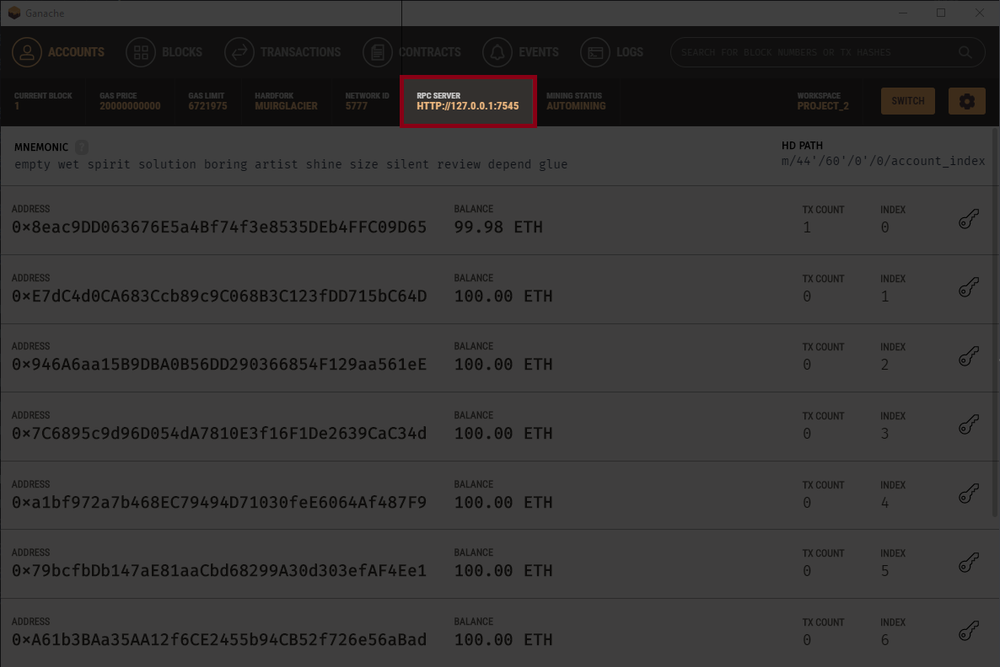
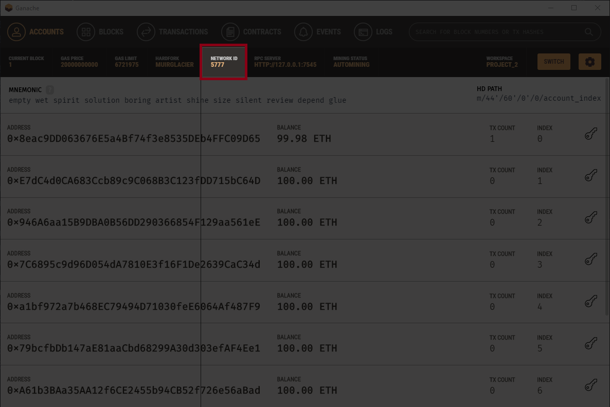

# Step by Step:

## Installations:

<ol>
  <li> 
    Install the LTS version of NodeJs: <a href="https://nodejs.org/en/" target="_blank">Download NodeJS</a>
  </li>

  <li> 
    Install Truffle:

      // Open the terminal and write:
      npm install -g truffle
      // To test the installation:
      truffle -v

  </li>

  <li>
    Install Ganache: <a href="https://trufflesuite.com/ganache/" target="_blank">Download Ganache</a>
  </li>

  <li>
    Configure Visual Studio Code:
    <ol>
      <li>
        <a href="https://code.visualstudio.com/Download" target="_blank">Download VSCode</a>
      </li>
      <li>
        Install Juan Blanco's Solidity extension:
        <a href="https://marketplace.visualstudio.com/items?itemName=JuanBlanco.solidity" target="_blank">VS Marketplace Link</a>
      </li>
    </ol>
  </li>

  <li>
    Download this project to your machine

    git clone `URL_this_repo`

  </li>
</ol>

## Pre-Execution

<ol>
  <li>
    Open the Ganache
  </li>
  <li>
    Click on Quickstart
  </li>
  <li>
    Get the RPC SERVER
     
    
  </li>
  <li>
    Get the NETWORK ID
     
    
  </li>
  <li>
    Open the file truffle-config.js located in the root of this project

    // Add the first part of the RPC SERVER URL (up to the colon)
    // in the host configuration of the networks key
    HTTP://127.0.0.1

    // Add the second part of the RPC SERVER URL (after the colon)
    // in the port configuration in the network key
    7545

    // Add the NETWORK ID in the network_id configuration in the networks key
    5777

  </li>

  <li>
    Open the project folder in the terminal and run:

    // To install all dependencies
    npm install

    // To start the truffle console
    truffle console

    // To execute the build of the contracts
    compile

    // To run the deployment of the contracts
    migrate

  </li>
</ol>

## Execution

To test how the smart contract works, just open the truffle console in the terminal.

And run these commands (Remember that truffle uses [web3js](https://web3js.readthedocs.io/en/v1.8.0/web3-eth.html), which has several methods that can be executed):

    // Get accounts in network
    const accounts = await web3.eth.getAccounts()

    // Print accounts
    accounts

    // Get smart contract instance
    const taskManager = await TaskManager.deployed()

    // To know everything that can be used, just type the name of the variable that received the smart contract instance and press 2x TAB

    // To fetch public variables from the smart contract just run the variable name as a function
    taskManager.nTasks()

    // To convert from big number to a string with normal, just run
    (await taskManager.nTasks()).toString()

    // Execution of functions declared in the smart contract
    taskManager.listMyTasks()

    taskManager.getTask(0)

    // Add transactions from smart contract functions as another account and no longer the smart contract creator, which in this case is account 0
    tx = await taskManager.addTask("Study solidity", 1, 2, {from: accounts[1]})

    // To view the event that was triggered after insertion, simply look at the log at position 0
    tx.logs[0]

    // List tasks from account 1
    taskManager.getTask(0, {from: accounts[1]})

    // Update the phase of the task, that is, update the blocks
    taskManager.updateTask(1, 2)
